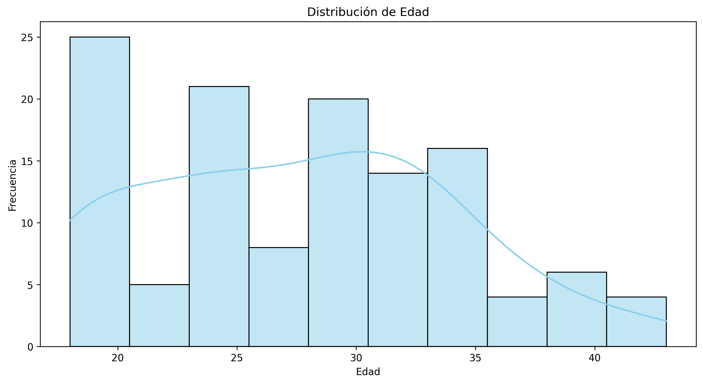
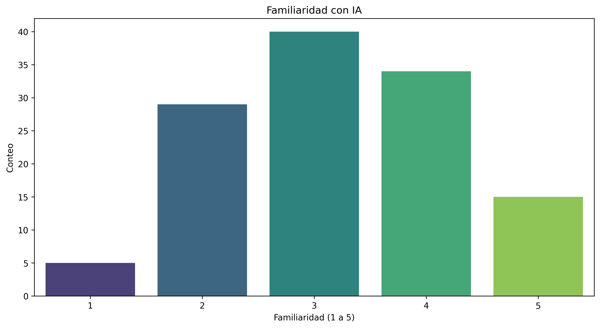
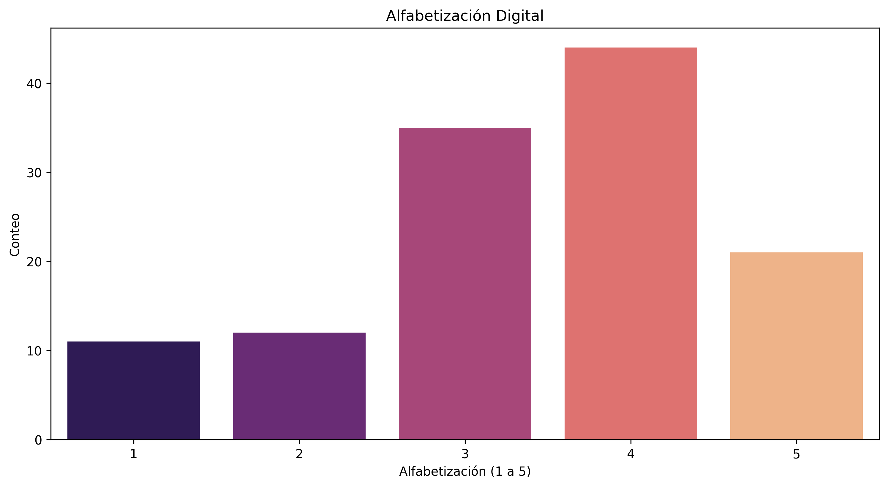
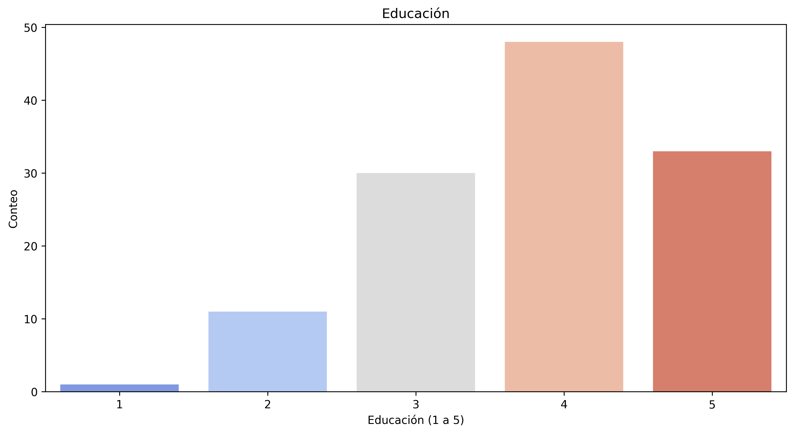

# Descripción de los Datos

Este documento proporciona una descripción de los valores mostrados en los gráficos generados a partir de los datos del experimento.

## Distribución de Edad
- **Descripción**: Muestra la distribución de las edades de los participantes en el experimento.
- **Rango**: La edad de los participantes varía, proporcionando una visión de la diversidad etaria en el estudio.

## Familiaridad con IA
- **Descripción**: Representa el nivel de familiaridad de los participantes con la inteligencia artificial, medido en una escala de Likert de 1 a 5.
- **Interpretación**: Un valor más alto indica una mayor familiaridad con la IA.

## Alfabetización Digital
- **Descripción**: Indica el nivel de alfabetización digital de los participantes, medido en una escala de Likert de 1 a 5.
- **Interpretación**: Un valor más alto sugiere una mejor alfabetización digital.

## Educación
- **Descripción**: Refleja el nivel educativo de los participantes, medido en una escala de Likert de 1 a 5.
- **Interpretación**: Un valor más alto indica un mayor nivel educativo.

## Visualizaciones

### Distribución de Edad

### Familiaridad con IA

### Alfabetización Digital

### Educación

