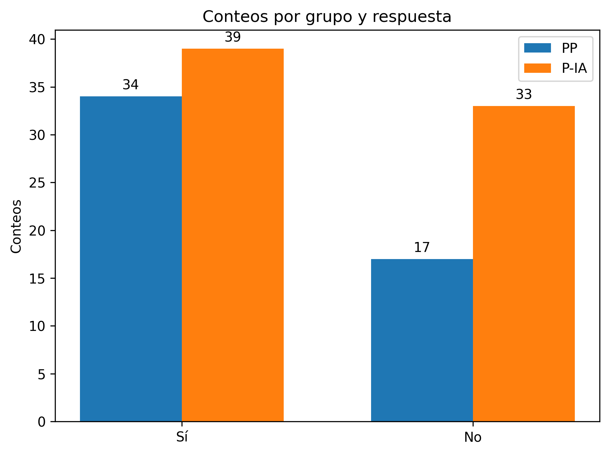
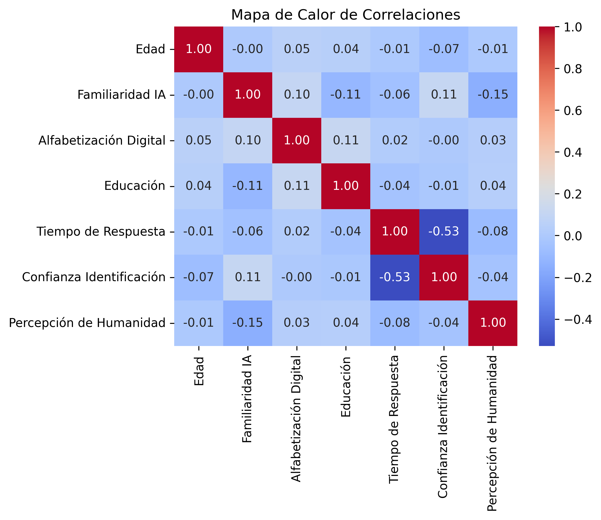

# Resultados del Experimento

## Análisis de Identificación

### Descripción del Conjunto de Datos
- **Número total de filas**: 119
- **Número total de filas P-P**: 50
- **Número total de filas P-IA**: 69

### Respuestas de Identificación (SI/NO)

| Respuesta | Conteo PP | % PP  | Conteo P-IA | % P-IA |
|-----------|-----------|-------|-------------|--------|
| SI        | 34        | 68.0% | 37          | 53.6%  |
| NO        | 16        | 32.0% | 32          | 46.4%  |
| Total     | 50        |       | 69          |        |

### Tabla de Contingencia

| Grupo | SI | NO |
|-------|----|----|
| PP    | 34 | 16 |
| PIA   | 37 | 32 |

### Análisis de Hipótesis
- **Chi2**: 2.490
- **p-valor**: 0.1146
- **Conclusión**: No hay una diferencia significativa entre los dos grupos. No rechazamos la hipótesis nula.

## Análisis de Tiempo de Respuesta

### Métricas del Conjunto de Datos

| Métrica | Conjunto de Datos PP | Conjunto de Datos P-IA |
|---------|----------------------|------------------------|
| Mediana | 6851                 | 7255                   |
| Tamaño  | 48                   | 67                     |
| Promedio| 6930.6               | 7221.75                |
| Mínimo  | 3694                 | 3547                   |
| Máximo  | 9671                 | 10914                  |
| Desv. Estándar | 1557.37       | 1878.12                |

### Análisis de Hipótesis

#### Prueba de Normalidad

| Conjunto de Datos   | Shapiro-Wilk W | p-valor | ¿Distribuido Normalmente? |
|---------------------|----------------|---------|---------------------------|
| Tiempo de respuesta PP | 0.968        | 0.2163  | Sí                        |
| Tiempo de respuesta P-IA | 0.981      | 0.4105  | Sí                        |

#### Prueba T
- **Estadístico de la prueba T**: -0.871
- **p-valor**: 0.3854
- **Conclusión**: No hay una diferencia significativa entre los dos grupos. No rechazamos la hipótesis nula.

## Conclusiones del Análisis

### Análisis de Tiempo de Respuesta
El análisis del tiempo de respuesta mostró que no hay una diferencia significativa entre los grupos Persona–Persona y Persona–IA. Esto sugiere que el tiempo que los participantes tardan en identificar a su contraparte no varía considerablemente dependiendo de si interactúan con una persona o una IA.

### Análisis de Identificación
En el análisis de identificación, no se encontró una diferencia significativa en la capacidad de los participantes para identificar correctamente a su contraparte como persona o IA. Esto indica que los participantes no son significativamente mejores en identificar a una IA en comparación con una persona en este contexto de negociación.

### Análisis de Correlaciones
El análisis de correlaciones reveló algunas relaciones interesantes:
- **Confianza en la Identificación y Tiempo de Respuesta**: Existe una correlación negativa moderada, lo que sugiere que a mayor confianza en la identificación, menor es el tiempo de respuesta.
- **Familiaridad con IA y Percepción de Humanidad**: Se observó una correlación negativa débil, indicando que una mayor familiaridad con IA podría estar asociada con una menor percepción de humanidad en las interacciones.

En general, las correlaciones entre las variables fueron débiles, lo que sugiere que no hay relaciones lineales fuertes entre ellas en este conjunto de datos.

## Visualizaciones

### Análisis de Identificación

### Análisis de Tiempo de Respuesta

### Análisis de Correlaciones

